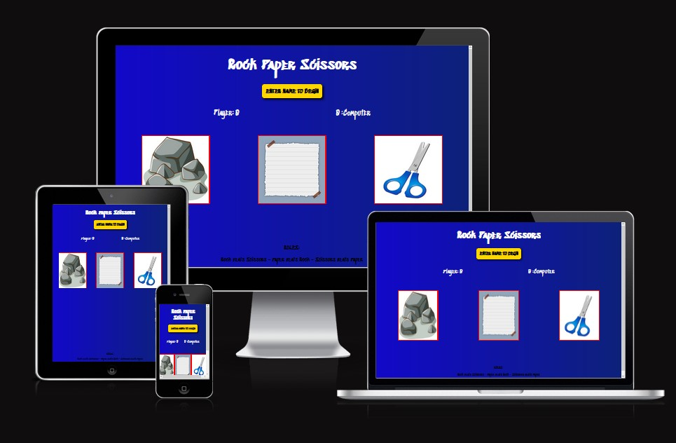

# Rock Paper Scissors Game

A simple rock paper scissors game.

A player can enter their name and then play versus the computer.

The player must choose from the 3 options of rock/paper/scissors and then get the computers choice.
After this the round winner will be declared and the appropriate display will be shown.

The game suits all ages but visually it is well suited for children.

The rules are - Rock beats Scissors - Paper beats Rock - Scissors beats Paper.

If both players choose the same thing then it is a draw.

First to a score of 3 wins the game.

