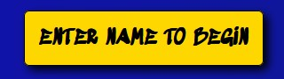

# Rock Paper Scissors Game

A simple rock paper scissors game.

A player can enter their name and then play versus the computer.

The player must choose from the 3 options of rock/paper/scissors and then get the computers choice.
After this the round winner will be declared and the appropriate display will be shown.

The game suits all ages but visually it is well suited for children.

The rules are - Rock beats Scissors - Paper beats Rock - Scissors beats Paper.

If both players choose the same item then it is a draw.

First to a score of 3 wins the game.

## Game Features

- **Logo**

  - The logo has a grafitti type vibe and turns green when hovered over, providing feedback to the player.
  - When clicked it will reset the game to it's default state so that a player can enter a new name.

  

- **Enter name button**

- The enter name button is the only button available upon game start and a name cannot be blank or longer than 10 characters.
- When a user enters their name it serves as a rounds to win display in game.

 

- **Scoreboard**

- A scoreboard to keep track of the round scores.

**Upper and lower displays**

- There are upper and lower displays that will display information to the user, such as the round winner/draw in the upper, and what the computer chose in the lower.

- **Central image display**

  - This is the main feature of the game and is presented in a picture-like display.
  - It is where all images will be loaded and displayed throughout the game.
  - At game start it defaults to the rock paper scissors images.

- **Navigation buttons**

  - Various buttons are displayed for navigation throughout the game, depending on who's turn it is, or the game state.
  - The example below is the players turn next, at round start.

- **Player choice buttons**

  - A player can choose from the 3 options of rock paper scissors from the player turn display.

- **The Footer**

- The footer displays the rules of the game.

### **Future features**
- Improvements to the graphical elements(Animated/Moving images etc.)
- Adding audio features to the game.
- Adding an option for changing the number of rounds to win.
- Adding another option to change names other than the logo.

### **Unfixed bugs**
- None.

### **Target Audiences**

- From kids to grannies and grandads.

### **User Stories**

- As a user, I want to play the game easily and intuitively.
- As a user, I want to be entertained.
- As a user, I want to feel a good vibe.
- As a user, I want the possibility to win.

### Design 

- I drew some images on paper for the layout and then implemented those ideas.
- I chose a nice bright colourful vibe to the game.
- I chose a uniformed look and simple interface.
- I chose to have various elements display or hide depending on the requirements and I used flexbox for a nice uniformed dynamic look.
- Below is a look at all of the elements the game contains, excluding all of the images.

### Media

- The images in the game were taken from https://www.freepik.com/.
- References to their authors are below.

<a href="https://www.freepik.com/free-vector/pile-stones-white-background_20498797.htm#query=cartoon%20rock&position=3&from_view=search&track=ais">Image by brgfx</a> on Freepik

<a href="https://www.freepik.com/free-vector/torn-paper-piece-design-background-vector_24611015.htm#query=cartoon%20paper&position=8&from_view=search&track=ais">Image by Creative_hat</a> on Freepik

<a href="https://www.freepik.com/free-vector/scissors-realistic_3056602.htm#query=cartoon%20scissors&position=4&from_view=search&track=ais">Image by katemangostar</a> on Freepik

<a href="https://www.freepik.com/free-vector/boy-using-computer_4606803.htm#query=computer%20cartoon&position=2&from_view=search&track=ais">Image by brgfx</a> on Freepik

<a href="https://www.freepik.com/free-vector/cute-happy-laptop-floating-cartoon-vector-icon-illustration-technology-object-concept-isolated-flat_48114013.htm#query=computer%20cartoon&position=4&from_view=search&track=ais">Image by catalyststuff</a> on Freepik

<a href="https://www.freepik.com/free-vector/comic-style-question-mark-speech-bubble-background_7082687.htm#query=question%20mark%20cartoon&position=8&from_view=search&track=ais">Image by starline</a> on Freepik

<a href="https://www.freepik.com/free-vector/versus-vs-letters-fight-flat-comics-style-design-with-halftone-lightning_13466740.htm#query=vs%20cartoon&position=1&from_view=search&track=ais">Image by jcomp</a> on Freepik

<a href="https://www.freepik.com/free-vector/katana-sword-cartoon-vector-icon-illustration-ninja-object-icon-concept-isolated-flat-vector_57146113.htm#query=2%20swords%20cartoon&position=12&from_view=search&track=ais">Image by catalyststuff</a> on Freepik

### Tech

- HTML
- CSS & Flexbox
- Javascript

- I used VSCode for the project creation, with the Prettier extension for the formatting.
- I used https://imageresizer.com/ for the resizing of the images.